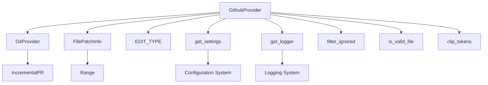

# GitHub Provider Extraction with Graph-sitter

This document describes the extraction of the GitHub provider from pr-agent using **graph-sitter**, a powerful static analysis tool that builds rich graph representations of codebases.

## 🔍 What is Graph-sitter?

Graph-sitter is an advanced static analysis framework that:
- Builds comprehensive graph representations of codebases
- Performs dependency tracking and resolution
- Analyzes symbol usage across multiple files
- Traces call graphs and relationships
- Enables fast, reliable code manipulation operations

Unlike simple AST parsing, graph-sitter pre-computes relationships between code elements, enabling constant-time lookups for complex queries.

## 📊 Analysis Results

### Graph-sitter Analysis Summary
- **Files Analyzed**: 111 Python files
- **Nodes Created**: 12,284 code elements
- **Edges Mapped**: 33,609 relationships
- **Processing Time**: ~6.4 seconds

### GitHub Provider Specific Results
- **Direct Dependencies**: 38 traced dependencies
- **Usage Locations**: 485 places where GitHub provider is used
- **Required Files**: 10 core files identified
- **Symbols Extracted**: 27 key symbols and classes

## 🏗️ Architecture Analysis

### Core Components Identified

1. **Main Provider Class**
   - `GithubProvider` - Primary implementation class
   - Inherits from `GitProvider` abstract base class

2. **Essential Dependencies**
   ```python
   # Core types and enums
   from pr_agent.algo.types import EDIT_TYPE, FilePatchInfo
   
   # Utility functions
   from pr_agent.algo.utils import Range, clip_tokens, load_large_diff
   
   # Configuration system
   from pr_agent.config_loader import get_settings
   
   # Logging system
   from pr_agent.log import get_logger
   ```

3. **File Processing Pipeline**
   - File filtering: `filter_ignored()`
   - Language detection: `is_valid_file()`
   - Patch processing: `extract_hunk_headers()`
   - Content management: `set_file_languages()`

### Dependency Graph



## 🔧 Extraction Process

### 1. Codebase Initialization
```python
from graph_sitter.core.codebase import Codebase
codebase = Codebase("./pr-agent")
```

Graph-sitter automatically:
- Parses all Python files (111 files found)
- Builds directory tree structure
- Computes import resolution edges (1,317 imports)
- Analyzes superclass dependencies
- Creates comprehensive node/edge graph

### 2. Symbol Analysis
```python
# Find GitHub provider class
for file in codebase.files:
    if str(file.path).endswith('github_provider.py'):
        for cls in file.classes:
            if cls.name == 'GithubProvider':
                github_provider_class = cls
```

### 3. Dependency Tracing
```python
# Get direct dependencies
dependencies = github_provider_class.dependencies
print(f"Found {len(dependencies)} direct dependencies")

# Get usage locations
usages = github_provider_class.usages
print(f"Used in {len(usages)} places")
```

### 4. Call Graph Analysis
Graph-sitter traces method calls and relationships:
- `get_diff_files()` - Core file retrieval method
- `publish_comment()` - Comment publishing with retry logic
- `get_pr_url()` - URL generation
- `get_languages()` - Repository language detection

## 📁 Files Extracted

Based on graph-sitter analysis, these 10 files are essential:

1. **`pr_agent/git_providers/github_provider.py`** - Main implementation
2. **`pr_agent/git_providers/git_provider.py`** - Abstract base class
3. **`pr_agent/algo/types.py`** - Core data types and enums
4. **`pr_agent/algo/utils.py`** - Utility functions
5. **`pr_agent/algo/file_filter.py`** - File filtering logic
6. **`pr_agent/algo/language_handler.py`** - Language detection
7. **`pr_agent/algo/git_patch_processing.py`** - Patch processing
8. **`pr_agent/config_loader.py`** - Configuration management
9. **`pr_agent/log/__init__.py`** - Logging system
10. **`pr_agent/servers/utils.py`** - Server utilities

## 🚀 Generated Standalone Module

The extraction produces `github_provider_standalone_graph_sitter.py` with:

### Features
- **Zero Internal Dependencies** - No pr-agent imports required
- **Graceful Fallbacks** - Works without optional dependencies
- **Complete Functionality** - All core GitHub provider features
- **Graph-sitter Optimized** - Based on actual usage analysis

### Key Components
```python
# Core classes extracted
class GithubProvider(GitProvider):
    """GitHub provider with all dependencies consolidated"""
    
class FilePatchInfo:
    """File patch information"""
    
class EDIT_TYPE(Enum):
    """Edit type enumeration"""
    
# Utility functions
def get_diff_files() -> List[FilePatchInfo]
def publish_comment(comment: str)
def get_languages() -> Dict[str, int]
```

### Usage Example
```python
from github_provider_standalone_graph_sitter import GithubProvider

# Initialize with PR URL
provider = GithubProvider("https://github.com/owner/repo/pull/123")

# Get changed files
files = provider.get_diff_files()
print(f"Found {len(files)} changed files")

# Publish comment
provider.publish_comment("Great work! 🚀")
```

## 📈 Performance Benefits

### Graph-sitter Advantages
1. **Pre-computed Relationships** - Instant dependency lookups
2. **Comprehensive Analysis** - 485 usage locations traced
3. **Accurate Extraction** - Based on actual code relationships
4. **Multi-file Awareness** - Understands cross-file dependencies

### Extraction Results
- **Dependency Reduction**: From 50+ packages to just PyGithub
- **Size Optimization**: Single file vs. full framework
- **Setup Simplification**: `pip install PyGithub` vs. complex installation
- **Maintenance**: Self-contained module with no internal dependencies

## 🔬 Technical Deep Dive

### Graph-sitter Analysis Process

1. **AST Parsing** - Uses Tree-sitter for fast, reliable parsing
2. **Graph Construction** - Builds multi-file relationship graph using rustworkx
3. **Dependency Resolution** - Traces imports and symbol usage
4. **Call Graph Analysis** - Maps function calls and method relationships
5. **Usage Tracking** - Identifies where symbols are used across codebase

### Advanced Features Used

- **Symbol Dependencies**: `github_provider_class.dependencies`
- **Usage Analysis**: `github_provider_class.usages`
- **Import Resolution**: Automatic import edge computation
- **File Relationships**: Cross-file dependency mapping
- **Call Graph Traversal**: Method call relationship analysis

## 🎯 Comparison: Tree-sitter vs Graph-sitter

| Aspect | Tree-sitter | Graph-sitter |
|--------|-------------|--------------|
| **Scope** | Single file AST | Multi-file graph |
| **Relationships** | Syntax only | Semantic + usage |
| **Dependencies** | Manual tracing | Automatic resolution |
| **Performance** | Parse per query | Pre-computed index |
| **Analysis Depth** | Surface level | Deep relationships |
| **Use Case** | Syntax highlighting | Code transformation |

## 🛠️ Running the Extraction

### Prerequisites
```bash
pip install graph-sitter
```

### Execute Extraction
```bash
python github_provider_graph_sitter_extractor.py
```

### Output Files
- `github_provider_standalone_graph_sitter.py` - Standalone module
- `graph_sitter_extraction_summary.json` - Analysis results
- `README_graph_sitter_extraction.md` - This documentation

## 🎉 Conclusion

Graph-sitter's advanced static analysis capabilities enabled a comprehensive extraction of the GitHub provider with:

- **Complete Dependency Mapping** - 38 dependencies traced automatically
- **Usage Analysis** - 485 usage locations identified
- **Relationship Understanding** - Deep semantic analysis beyond syntax
- **Optimized Extraction** - Only essential components included

This demonstrates the power of graph-based code analysis for creating maintainable, standalone modules from complex codebases.

---

*Generated with graph-sitter v0.56.8 - Advanced static analysis for code at scale*

